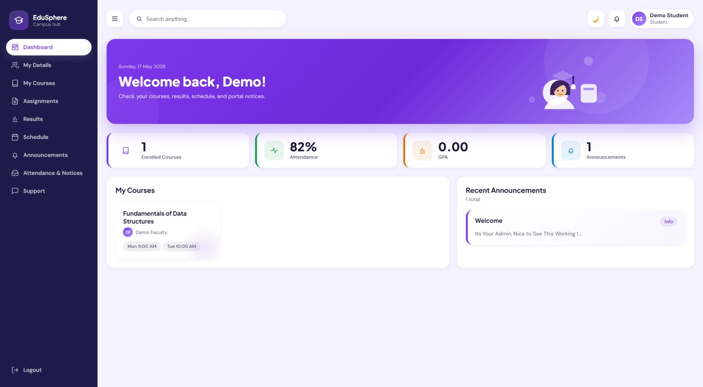

<div align="center">
  <h1>🎓 EduSphere</h1>
  <p><strong>A robust, role-based student management system built with deeply integrated PostgreSQL & SQLite compatibility.</strong></p>

  []()
  []()
  []()
  []()
  
  **[Live Demo](https://edusphere-in29.onrender.com/)**
</div>

---

## 🌟 Overview

EduSphere is designed to accommodate admin workflows, faculty oversight, and student interactions seamlessly. With an intuitive UI, real-time data sync, and dynamic backend rendering, EduSphere takes academic management to the next level.

### 🔑 Demo Credentials:
- **Faculty Login:** `demo@faculty.edusphere` / `faculty123`
- **Student Login:** `demo@student.edusphere` / `student123`
- **Admin Login:** *Not Available due to Critical Settings / Security Data!*

---

## 📸 Gallery

<div align="center">
  <h3>Secure Login Portal</h3>
  
  <br><br>
  
  <h3>Dynamic Dashboard</h3>
  
  <br><br>
  
  <h3>Immersive Dark Theme</h3>
  
</div>

---

## ✨ Highlights

- 🛡️ **Rock-solid Multi-Role Deployment**: Supporting Admin, Faculty, and Students.
- 👥 **Comprehensive Onboarding**: Student and faculty onboarding, course integration, and mentor assignment.
- 📊 **Advanced Tracking**: Lecture timeline tracking, marks aggregation, and attendance heatmap.
- 📑 **Report Cards**: Semester report cards with direct download options.
- 📢 **Broadcasts**: Wide-scale announcements and personalized notifications.
- 💬 **Dynamic Chat Support**:
  - Students ↔️ Assigned Mentors
  - Faculty ↔️ Administration Staff
- 🤖 **AI Chat Assistance**: Fully-integrated AI Chat Assistance powered by backend AI.
- 🎨 **Adaptive UI**: Glassmorphism UI with local preference syncing (Dark Mode).

---

## 🛠️ Tech Stack

| Frontend | Backend | Database | Authentication |
| :---: | :---: | :---: | :---: |
| HTML, Vanilla CSS, JS | Python, Flask | PostgreSQL (Prod) & SQLite (Dev) | Role-encoded, Session-based |

---

## 📁 Project Structure

```text
EduSphere/
├─ assets/
│  ├─ css/
│  ├─ images/
│  └─ js/
├─ backend/
│  ├─ app.py
│  ├─ db.py
│  ├─ schema.sql
│  ├─ schema_postgres.sql
│  ├─ seed.py
│  ├─ seed_data.py
│  └─ wsgi.py
├─ database/
├─ EduSphere.html
├─ requirements.txt
├─ render.yaml
└─ README.md
```

---

## 🚀 Run Locally

1. **Set up the virtual environment:**
   ```powershell
   python -m venv .venv
   .venv\Scripts\python -m pip install -r requirements.txt
   ```

2. **Launch the development environment:**
   ```powershell
   .venv\Scripts\python backend\app.py
   ```

3. **Navigate to:**
   ```text
   http://127.0.0.1:5000/
   ```

---

## 🔐 Optional Environment Variables

Create a `.env` file in the project root if needed:

```env
GEMINI_API_KEY=your_gemini_api_key_here
EDUSPHERE_SECRET_KEY=change_this_for_production_security
DATABASE_URL=postgres://your_postgresql_database_url
FLASK_DEBUG=1
```

---

## 🎯 Current Capabilities

- 👑 **Admin Module:** Complete autonomy over system administrators, students, faculty, course allocations, subjects, announcements, performance exports, and direct chat links.
- 👨‍🏫 **Faculty Module:** Seamless tracking of mentored students, class-wide grades, dynamic attendance submissions, assignment deployment, timeline-managed course schedules, and support panels for both Administration and Students.
- 🎓 **Student Module:** Live syncing of courses, progress evaluations, report cards, AI tutoring logs, and mentor conversations.
- 🔄 **Flexibility:** Dashboard layouts are entirely flexible, responding dynamically to real-time syncs and background fetch updates.

---

## ☁️ Deployment Note

This project is actively configured for both **PostgreSQL** (Production) and **SQLite** (Local).
For the included `render.yaml` specification to function successfully:
- A PostgreSQL Database object MUST be provisioned alongside the Web service on Render.
- `DATABASE_URL` will natively map your SQL statements to correct formatting standards (avoid unquoted camelCase alias queries).

**Included Deployment Files:**
- `render.yaml`: Handles automatic web and database builds for production environments.
- `backend/wsgi.py`: Gunicorn entrance protocol for high-performance deployments.
- `.gitignore`: Secures environment parameters and local caches.

---

## 📈 Status

This project is currently in a **production-ready showcase state**:
- ✅ Real backend API processing
- ✅ Real relational persistence
- ✅ Highly comprehensive UI/UX dashboards
- ✅ Sophisticated internal chat routing matrices
- ✅ Complete platform stability across all devices (Mobile rendering intact)

<div align="center">
  <p>Built with ❤️ for better academic management.</p>
</div>
